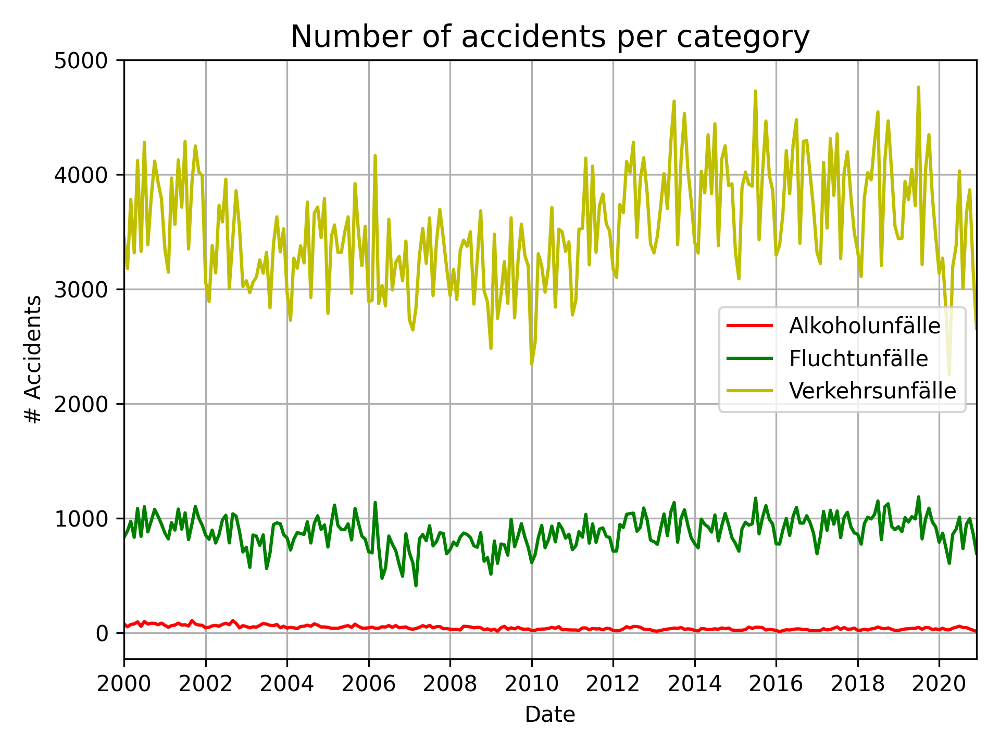
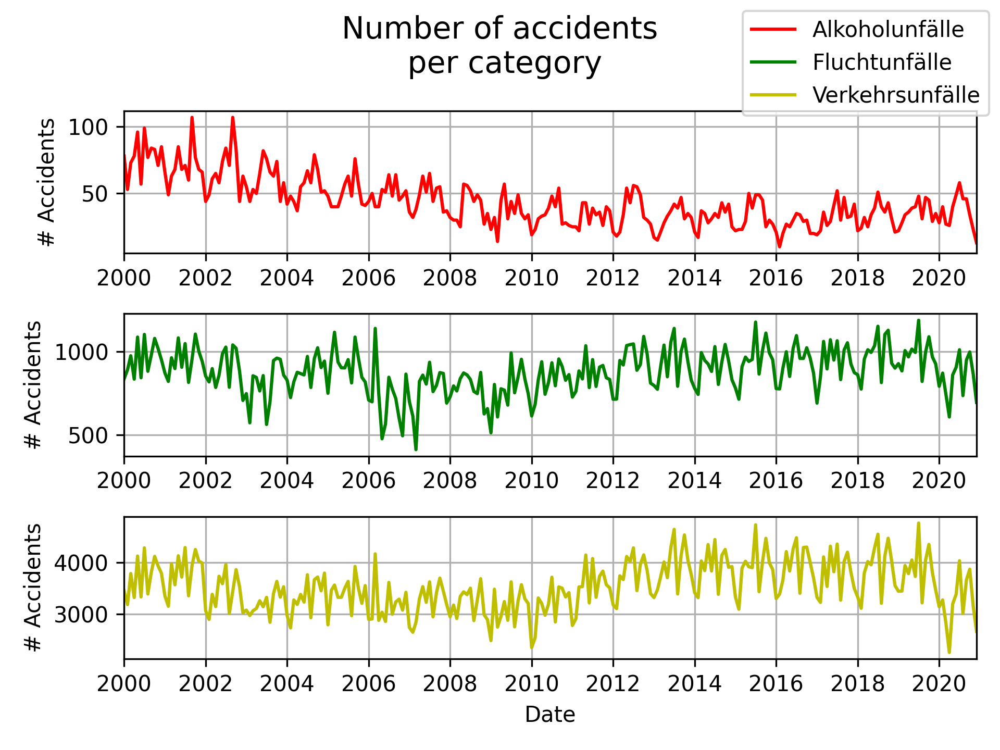
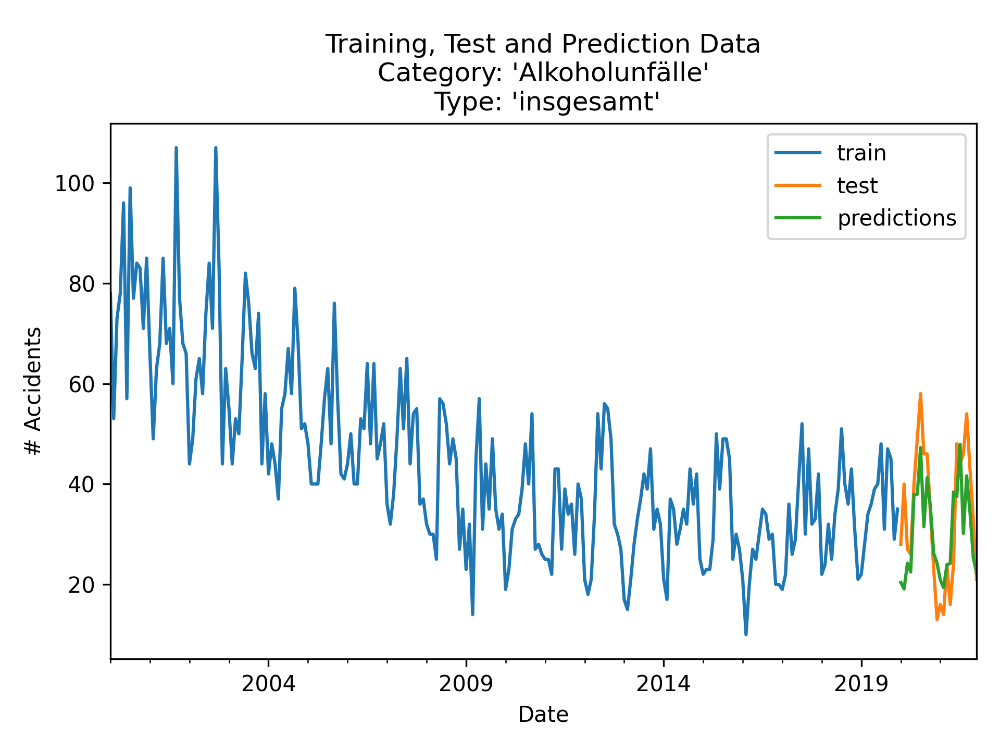

# DPS-Challenge
Challenge for DPS AI Engineer, Johannes Kiwi

## 1. Mission
- Visualizations of data with _matplotlib_ (2 different visualization forms for input data):

- Feature engineering with _pandas_
- Forecaster models:
    - AutomaticForecasting (_pyaf_)
    - AutoregressiveModel (_sklearn_)

    => _pyaf_ model chosen due to better performance, prediction results:

- __main.py__ implements training and prediction pipeline (and some more functions to generate and save plots), only for running on local machine

## 2. Mission
- Add __app.py__ to load the trained model (pickle)
- __app.py__ receives json input format to predict value for specified 'year' and 'month'
- __app.py__ sends predicted value as json output

- Use __Flask__ to wrap inference logic to web service

- Containerize app with __Docker__

- Host __Docker__ container on __AWS ec2__ instance

